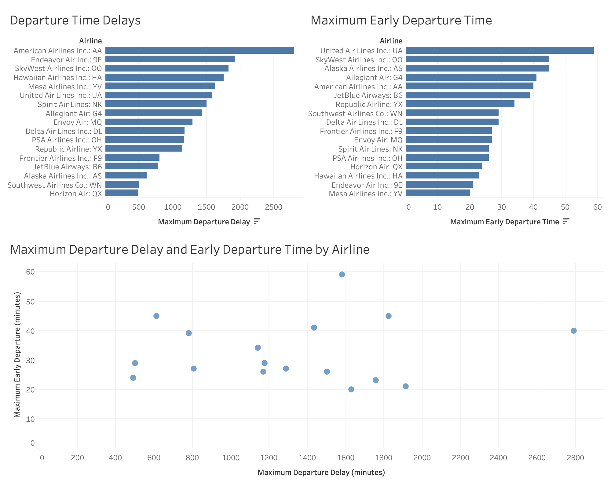

### Education
Data Science and Analytics, MS  
Georgetown University, May 2025

Biology of Global Health, BS  
Georgetown University, May 2024

### Projects

- [Travel Advice from Reddit Text Data](projects/project1.md)
- [February 2021 Flight Analysis](projects/project2.md)
- [Airline Passenger Satisfaction](projects/project3.md)
- [NHL Power Play Analysis](projects/project4.md)

  <a href="projects/project1.md" class="project-card">
    
    
Travel Advice from Reddit Text Data

  </a>
  <a href="projects/project2.md" class="project-card">
    
    
February 2021 Flight Analysis

  </a>
  <a href="projects/project3.md" class="project-card">
    
    
Airline Passenger Satisfaction

  </a>
  <a href="projects/project4.md" class="project-card">
    
    
NHL Power Play Analysis

  </a>

### Work and Other Experiences

**Spaghetti Lane**, Barrington, RI  
*Seasonal Server/Front of House Supervisor*   
May 2020 – Aug 2024  
Initially hired as a server, advanced to supervisor managing weekly payroll reporting, training and scheduling for a team of fifteen employees.  

**Limber Health**, Washington, DC  
*Business Development and Sales Intern*  
May 2023 – Aug 2023  
* Conducted analysis of enrollment data across 15+ client accounts, identifying growth opportunities and providing actionable insights
* Collaborated with senior sales team members to identify and prospect 50+ target PT clinics
* Assisted in the design and execution of tailored initiatives to boost client enrollment figures  

**Kappa Alpha Theta Sorority**, Washington, DC  
*Vice President of Operations for Theta Iota Chapter*  
Dec 2022 – Dec 2023  
* Managed chapter budget of almost $40,000 and chaired two committees focused on member engagement and retention
* Directed the planning and execution of all chapter events including formals, retreats, and bonding activities  

*Vice President of Panhellenic for Theta Iota Chapter*  
Jan 2022 – Dec 2022  
* Served as delegate to campus Panhellenic Council and coordinated meetings of 100+ potential new members with chapter
* Increased membership acceptance by 18% after reevaluating recruitment strategy based on new member feedback  

**One Tent Health**, Washington, DC 
*HIV Screening Volunteer*  
Apr 2022 – Oct 2022  
* Recruited residents of DC’s most HIV burdened neighborhoods to receive a free HIV screen
* Communicated information about HIV, conducted INSTI Rapid HIV, and  informed patients of results and next steps  

### About Me
Learn more [About Me](about.md).
